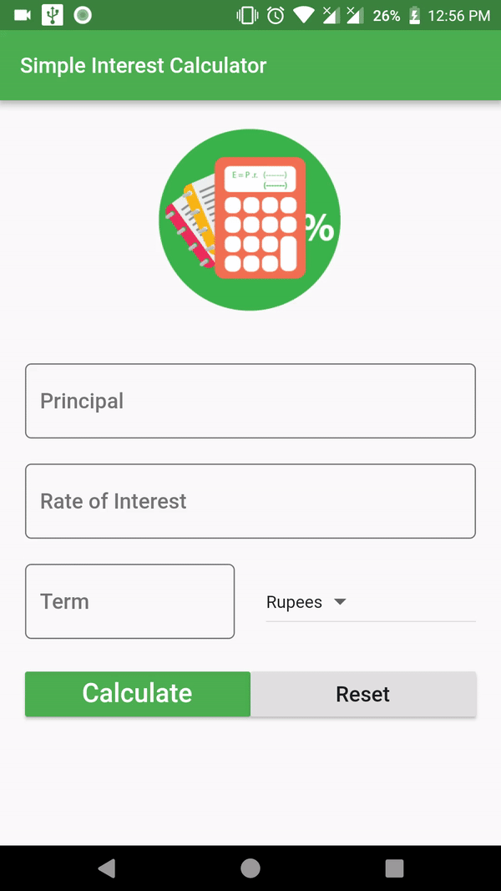
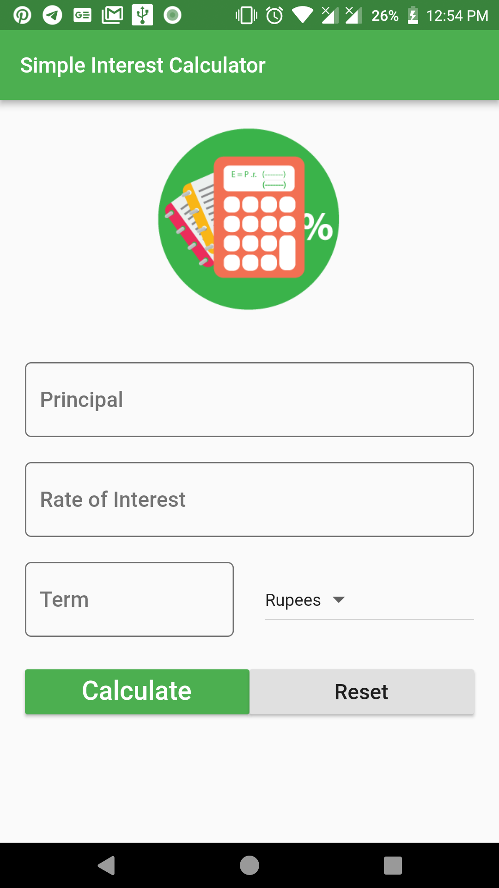
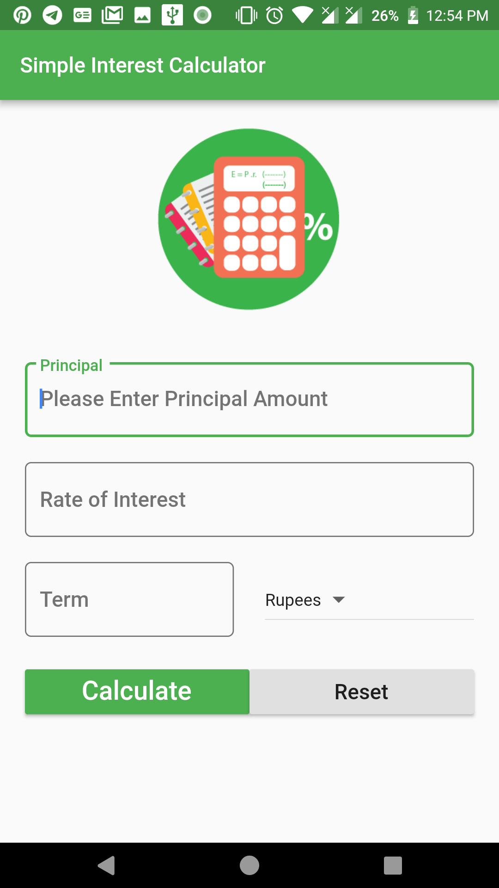
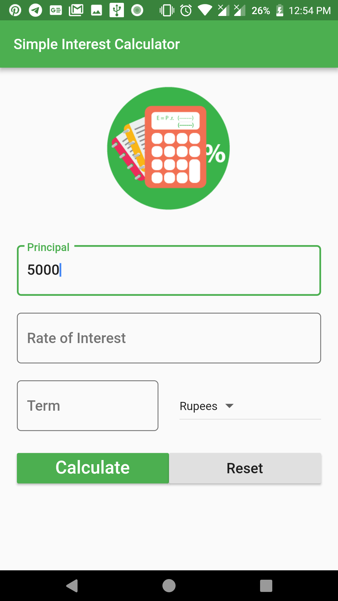
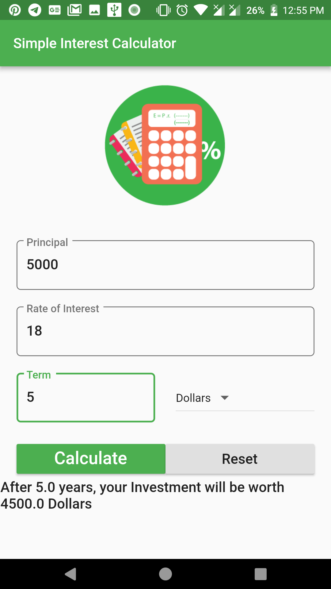

# SIMPLE INTEREST CALCULATOR

An Application, Simple Interest Calculator built with Flutter .

## Getting Started

This project is buit by using Flutter Dart programming language, used to calculate simple interest user has to enter the principal amount, rate of interest and term and the currency he wanted to and if he click on calculate this app calculates the interest and show the result.

## Working demo of this Application 
 

## Screenshots of this Application  

A few resources to get you started if this is your first Flutter project:

- [Lab: Write your first Flutter app](https://flutter.io/docs/get-started/codelab)
- [Cookbook: Useful Flutter samples](https://flutter.io/docs/cookbook)

For help getting started with Flutter, view our 
[online documentation](https://flutter.io/docs), which offers tutorials, 
samples, guidance on mobile development, and a full API reference.
